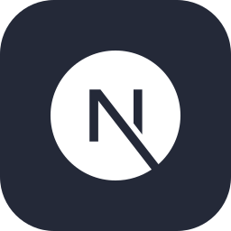
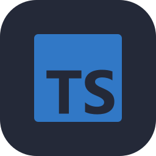
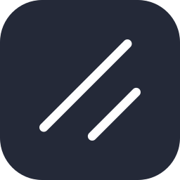
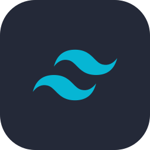
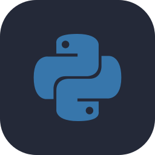
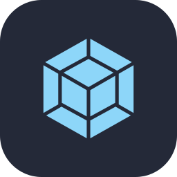

## Hi I'm Harry Ashton

I'm an Ex-Lead/Senior Frontend Developer. I have over 11 years experience in commercial frontend development, working in product teams, leading engineering teams and even coaching other frontend developers of all levels to get better at their craft or even get a new job. My specialisations are Complex UI, Accessibility, Design Systems and UI Architecture.

# Repositories

Just to note, my current repositories are commercial apps and are therefore mostly private but I primarily work with NextJS, TypeScript, ShadnCN, Tailwind CSS, Zod, PostGres SQL, Python, Webpack, pnpm and much more. I love making useful developer tools as well within teams.

  

